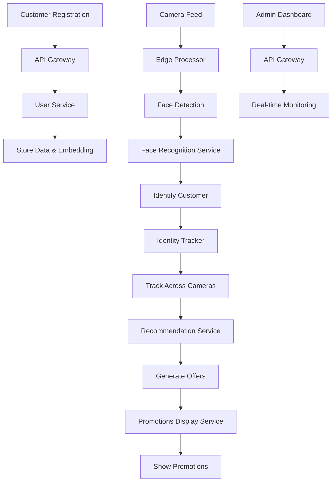

# Project Scarlet API Documentation

## Overview

Project Scarlet is a comprehensive retail analytics system that uses computer vision, face recognition, and real-time tracking to provide personalized customer experiences. This documentation covers all backend services and their APIs.

## Services Overview

### 1. API Gateway
**Port:** 8000  
**Purpose:** Central entry point for all client requests, handles authentication, routing, and WebSocket connections.

### 2. Edge Processor
**Port:** 8000  
**Purpose:** Processes video streams from cameras, detects people and faces, manages camera connections.

### 3. Face Recognition Service
**Port:** 8000  
**Purpose:** Generates face embeddings and performs face recognition using DeepFace and Milvus vector database.

### 4. Identity Tracker
**Port:** 8000 (default, configurable)  
**Purpose:** Tracks customer identities across cameras, manages person tracking data in Redis.

### 5. Promotions Display Service
**Port:** 8002  
**Purpose:** Manages promotional content and displays personalized offers based on customer loyalty status.

### 6. User Service
**Port:** 8001  
**Purpose:** Manages customer data, registration, and loyalty status using SQLAlchemy and Milvus.

### 7. Recommendation Service
**No REST API**  
**Purpose:** Processes customer identification events and generates product recommendations via Kafka messaging.

---

## API Gateway Service

### Authentication Endpoints

#### POST /admin/login
Authenticate admin user and return JWT token.

**Request Body:**
```json
{
  "username": "string",
  "password": "string"
}
```

**Response (200):**
```json
{
  "access_token": "string",
  "token_type": "bearer",
  "expires_in": 1800,
  "user": {
    "username": "string",
    "full_name": "string",
    "email": "string",
    "is_active": true,
    "created_at": "string"
  }
}
```

**Error Codes:**
- 401: Incorrect username or password / User account is disabled

#### POST /admin/logout
Logout admin user by invalidating token.

**Authentication:** Bearer token required  
**Response (200):** `{"message": "Successfully logged out"}`

### Admin User Management

#### GET /admin/users
Get all admin users.

**Authentication:** Bearer token required  
**Response (200):** Array of admin user objects

#### POST /admin/users
Create a new admin user.

**Authentication:** Bearer token required  
**Request Body:**
```json
{
  "username": "string",
  "password": "string",
  "full_name": "string",
  "email": "string"
}
```

**Response (201):** Created admin user object  
**Error Codes:** 400 - Username already exists

#### DELETE /admin/users/{username}
Delete an admin user.

**Authentication:** Bearer token required  
**Error Codes:** 404 - User not found, 400 - Cannot delete your own account

### Dashboard Endpoints

#### GET /health
Health check endpoint.

**Response (200):** `{"status": "healthy"}`

#### GET /metrics
Prometheus metrics endpoint.

**Response (200):** Prometheus metrics data

#### GET /admin/dashboard/stats
Get admin dashboard statistics.

**Authentication:** Bearer token required  
**Response (200):**
```json
{
  "total_users": 0,
  "active_users": 0,
  "total_logs": 0,
  "websocket_clients": 0,
  "server_status": "healthy"
}
```

#### GET /admin/logs
Get all logs for admin review.

**Authentication:** Bearer token required  
**Query Parameters:** `limit` (default: 100)

#### POST /register
Register a new customer.

**Request Body:**
```json
{
  "name": "string",
  "face_image_b64": "string"
}
```

**Response (200):**
```json
{
  "message": "string",
  "customer_id": "string"
}
```

**Error Codes:** 500 - Registration failed

#### GET /cameras
Get list of cameras from edge processor.

**Response (200):** Array of camera state objects:
```json
{
  "id": "string",
  "name": "string",
  "status": "string",
  "last_seen": "string",
  "location": "string"
}
```

#### GET /logs
Get recent event logs.

**Query Parameters:** `limit` (default: 50)

#### GET /alerts/count
Get count of active alerts.

**Response (200):** `{"count": 0}`

#### WebSocket /ws/dashboard
Real-time dashboard updates including logs.

**Protocol:** WebSocket  
**Messages:** JSON updates with type, data, and timestamp

---

## Edge Processor Service

### Camera Management

#### GET /cameras/{camera_id}/stream
Get live video stream for a camera.

**Path Parameters:** `camera_id`  
**Response:** Multipart MJPEG stream  
**Error Codes:** 404 - Camera not found, 503 - Service not ready

#### GET /cameras/{camera_id}/tracking
Get current tracking data for a camera.

**Path Parameters:** `camera_id`  
**Response (200):**
```json
{
  "camera_id": "string",
  "tracked_objects": [
    {
      "object_id": "string",
      "camera_id": "string",
      "bbox": [0, 0, 100, 100],
      "confidence": 0.8,
      "object_type": "person",
      "last_seen": "string",
      "user_id": "string",
      "identification_confidence": 0.0
    }
  ]
}
```

#### WebSocket /ws/tracking
Live tracking updates.

**Protocol:** WebSocket  
**Messages:** JSON updates with tracking data

---

## Face Recognition Service

### Health and Metrics

#### GET /health
Health check endpoint.

**Response (200):** `{"status": "healthy"}`

#### GET /metrics
Prometheus metrics endpoint.

**Response (200):** Prometheus metrics data

### Face Processing

#### POST /generate-embedding
Generate face embedding from image.

**Request Body:**
```json
{
  "face_image_b64": "string"
}
```

**Response (200):**
```json
{
  "embedding": [0.1, 0.2, ...]
}
```

**Error Codes:** 400 - Invalid image data, 500 - Failed to generate embedding

#### POST /recognize
Recognize face and return matching users.

**Request Body:**
```json
{
  "face_image_b64": "string"
}
```

**Response (200):**
```json
{
  "tracked_objects": [
    {
      "id": "string",
      "name": "string",
      "confidence": 0.95,
      "loyalty_status": "gold"
    }
  ]
}
```

#### GET /users/{user_id}/face
Get user face data.

**Path Parameters:** `user_id`  
**Response (200):** TrackedObject with user data  
**Error Codes:** 404 - User not found

---

## Identity Tracker Service

### Health Check

#### GET /health
Health check endpoint.

**Response (200):** `{"status": "healthy"}`

### Person Tracking

#### GET /persons/{person_id}
Get tracking data for a specific person.

**Path Parameters:** `person_id`  
**Response (200):**
```json
{
  "person_id": "string",
  "customer_id": "string",
  "first_seen": "string",
  "last_seen": "string",
  "cameras": ["cam1", "cam2"],
  "positions": [
    {
      "timestamp": "string",
      "camera_id": "string",
      "position": {"x": 100, "y": 200}
    }
  ]
}
```

**Error Codes:** 404 - Person not found

#### POST /track
Manually update tracking data.

**Request Body:** TrackingUpdate object  
**Response (200):** `{"status": "updated", "objects_count": 1}`

#### WebSocket /ws/tracking
Real-time tracking updates.

**Protocol:** WebSocket  
**Messages:** JSON tracking updates

---

## Promotions Display Service

### Health and Metrics

#### GET /health
Health check endpoint.

**Response (200):** `{"status": "healthy"}`

#### GET /metrics
Prometheus metrics endpoint.

**Response (200):** Prometheus metrics data

### Promotions Management

#### POST /promotions
Create a new promotion.

**Request Body:**
```json
{
  "title": "string",
  "description": "string",
  "discount": "string",
  "validity": "string",
  "target_loyalty_status": "all"
}
```

**Response (201):** Created promotion object

#### GET /promotions/{user_id}
Get personalized promotions for a user.

**Path Parameters:** `user_id`  
**Response (200):** Array of promotion objects filtered by loyalty status

---

## User Service

### Health and Metrics

#### GET /health
Health check endpoint.

**Response (200):** `{"status": "healthy"}`

#### GET /metrics
Prometheus metrics endpoint.

**Response (200):** Prometheus metrics data

### Customer Management

#### POST /register
Register a new customer with face data.

**Request Body:**
```json
{
  "name": "string",
  "email": "string",
  "face_image_b64": "string"
}
```

**Response (200):**
```json
{
  "message": "Registration successful",
  "customer_id": "string"
}
```

#### POST /auto-register
Auto-register a new customer from unrecognized face.

**Request Body:**
```json
{
  "face_image_b64": "string"
}
```

**Response (200):**
```json
{
  "message": "Auto-registration successful",
  "customer_id": "string"
}
```

#### GET /customer/{customer_id}
Get customer information.

**Path Parameters:** `customer_id`  
**Response (200):**
```json
{
  "id": "string",
  "name": "string",
  "email": "string",
  "loyalty_status": "bronze",
  "created_at": "string"
}
```

**Error Codes:** 404 - Customer not found

#### GET /customer/by-vector/{vector_id}
Get customer by Milvus vector ID.

**Path Parameters:** `vector_id` (integer)  
**Response (200):** Customer object  
**Error Codes:** 404 - Customer not found

---

## Recommendation Service

**Note:** This service does not expose REST API endpoints. It operates as a Kafka consumer/producer for event-driven recommendations.

### Kafka Topics

#### Consumer Topic: `customer-identified-events`
**Purpose:** Receives customer identification events from Identity Tracker

**Message Format:**
```json
{
  "customer_id": "string",
  "confidence": 0.95,
  "camera_id": "string",
  "timestamp": "string"
}
```

#### Producer Topic: `action-events`
**Purpose:** Publishes recommendation actions to Promotions Display Service

**Message Format:**
```json
{
  "customer_id": "string",
  "store_zone": "string",
  "recommended_products": ["prod1", "prod2", "prod3"],
  "timestamp": "string"
}
```

### Processing Logic

1. **Customer History:** Retrieves purchase history from Redis
2. **Zone Products:** Gets available products for the store zone
3. **Recommendation Generation:** Combines history-based and zone-based recommendations
4. **Action Publishing:** Sends personalized recommendations to display service

---

## Video API Documentation

### Edge Processor Video Endpoints

#### GET /cameras/{camera_id}/stream
Get live video stream for a camera.

**Path Parameters:** `camera_id`
**Response:** Multipart MJPEG stream
**Error Codes:** 404 - Camera not found, 503 - Service not ready

#### GET /cameras/{camera_id}/tracking
Get current tracking data for a camera.

**Path Parameters:** `camera_id`
**Response (200):**
```json
{
  "camera_id": "string",
  "tracked_objects": [
    {
      "object_id": "string",
      "camera_id": "string",
      "bbox": [0, 0, 100, 100],
      "confidence": 0.8,
      "object_type": "person",
      "last_seen": "string",
      "user_id": "string",
      "identification_confidence": 0.0
    }
  ]
}
```

#### POST /process-frame
Process a video frame from frontend and return overlay data.

**Request Body:**
```json
{
  "frame_b64": "string",
  "camera_id": "device-camera"
}
```

**Response (200):**
```json
{
  "camera_id": "string",
  "timestamp": "string",
  "detections": [
    {
      "bbox": [0, 0, 100, 100],
      "user_id": "string",
      "confidence": 0.0,
      "name": "string",
      "loyalty_status": "string",
      "object_id": "string"
    }
  ]
}
```

**Error Codes:** 400 - frame_b64 is required, 500 - Frame processing failed

#### WebSocket /ws/tracking
Live tracking updates.

**Protocol:** WebSocket
**Messages:** JSON updates with tracking data

---

## Authentication & Security

### JWT Authentication
- **Service:** API Gateway
- **Token Type:** Bearer
- **Expiration:** 30 minutes
- **Protected Endpoints:** All `/admin/*` routes

### WebSocket Security
- **Authentication:** Token-based for admin WebSockets
- **Real-time Updates:** Anonymous access for dashboard tracking

### Data Validation
- **Base64 Images:** Validated for face recognition endpoints
- **Input Sanitization:** Pydantic models ensure data integrity
- **SQL Injection Protection:** SQLAlchemy ORM prevents injection attacks

---

## Error Handling

### Common HTTP Status Codes
- **200:** Success
- **201:** Created
- **400:** Bad Request
- **401:** Unauthorized
- **404:** Not Found
- **500:** Internal Server Error
- **503:** Service Unavailable

### Error Response Format
```json
{
  "detail": "Error message description"
}
```

---

## Monitoring & Metrics

### Prometheus Metrics
All services expose `/metrics` endpoints with:
- Request counts by method, endpoint, and status
- Request latency histograms
- Service-specific counters (messages processed, commands sent, etc.)

### Health Checks
All services provide `/health` endpoints returning:
```json
{"status": "healthy"}
```

---

## Data Flow

1. **Registration:** Customer registers via API Gateway → User Service stores data and embedding
2. **Detection:** Edge Processor detects faces → Face Recognition identifies customers
3. **Tracking:** Identity Tracker maintains person tracking across cameras
4. **Recommendations:** Recommendation Service generates personalized offers
5. **Display:** Promotions Display Service shows targeted promotions
6. **Dashboard:** API Gateway provides real-time monitoring via WebSockets

### Data Flow Diagram



---

## Configuration

### Environment Variables
- **Database:** `DATABASE_URL` for User Service
- **Redis:** Host, port, DB for caching services
- **Milvus:** Host, port for vector database
- **Kafka:** Bootstrap servers, topics for messaging
- **JWT:** Secret key, algorithm for authentication

### Service Dependencies
- **API Gateway:** Depends on User Service for registration
- **Edge Processor:** Depends on Face Recognition and User Service
- **Face Recognition:** Depends on User Service for customer data
- **Identity Tracker:** Depends on Face Recognition and Redis
- **Promotions Display:** Depends on User Service for loyalty status
- **Recommendation Service:** Depends on Redis and Kafka

This documentation provides comprehensive coverage of all Project Scarlet APIs. For implementation details, refer to the individual service codebases.